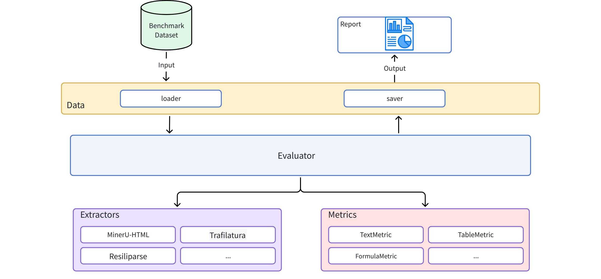

# WebMainBench

简体中文 | [English](README.md)

[](https://huggingface.co/datasets/opendatalab/WebMainBench)
[](https://arxiv.org/abs/2511.23119)
[](LICENSE)

**WebMainBench** 是一个用于评测网页正文抽取质量的高精度基准，提供：

- **7,809 页、100% 人工标注**的评测数据集，覆盖 5,434 个独立域名、150 个顶级域名和 46 种语言。
- **545 条样本子集**，附带人工校准的 ground-truth markdown（`groundtruth_content`），支持文本、代码、公式、表格维度的细粒度指标评测。
- 统一的 **评测工具包**（`webmainbench`），同时支持 ROUGE-N 和内容类型特定的编辑距离指标。

> WebMainBench 在论文 [*Dripper: Token-Efficient Main HTML Extraction with a Lightweight LM*](https://arxiv.org/abs/2511.23119) 中被提出，是 [MinerU-HTML](https://github.com/opendatalab/MinerU-HTML) 项目的核心评测基准。

## 系统架构



**核心模块：**

| 模块 | 说明 |
|---|---|
| `data` | 数据集加载、保存与样本管理 |
| `extractors` | 抽取器的统一接口与工厂注册 |
| `metrics` | 编辑距离、TEDS、ROUGE 指标实现 |
| `evaluator` | 编排抽取、评分和报告生成 |

## 数据集统计

完整数据集（7,809 条）在 HTML 标签级别通过严格的三轮流程标注（标注员 → 审核员 → 高级检查员）。

**语言分布（46 种语言中的前 10）**

| 语言 | 数量 | 占比 |
|---|---|---|
| 英语 | 6,711 | 85.09% |
| 中文 | 716 | 9.08% |
| 西班牙语 | 61 | 0.77% |
| 德语 | 51 | 0.65% |
| 日语 | 48 | 0.61% |
| 俄语 | 45 | 0.57% |
| 法语 | 36 | 0.46% |
| 意大利语 | 22 | 0.28% |
| 韩语 | 20 | 0.25% |
| 葡萄牙语 | 17 | 0.22% |

**TLD 分布（150 个中的前 10）**

| TLD | 数量 | 占比 |
|---|---|---|
| .com | 4,550 | 57.69% |
| .org | 816 | 10.35% |
| .cn | 459 | 5.82% |
| .net | 318 | 4.03% |
| .uk | 235 | 2.98% |
| .edu | 180 | 2.28% |
| .de | 101 | 1.28% |
| .au | 94 | 1.19% |
| .ru | 69 | 0.87% |
| .gov | 59 | 0.75% |

**页面类型与难度**

页面通过 GPT-5 分类为不同类型（Article、Content Listing、Forum 等），并基于 DOM 结构复杂度、文本分布稀疏度、内容类型多样性和链接密度计算综合复杂度分数，划分为 Simple / Mid / Hard 三个难度等级。

## 评测指标

WebMainBench 支持两套互补的评测协议：

### ROUGE-N F1（论文主指标）

所有抽取内容通过 `html2text` 转换为标准 Markdown，再用 ROUGE-N（N=5，jieba 分词）评分。这是 [Dripper 论文](https://arxiv.org/abs/2511.23119) 中报告的指标。

### 细粒度编辑距离指标（本工具包提供）

基于 545 条人工校准 `groundtruth_content` 的子集计算：

| 指标 | 公式 | 说明 |
|---|---|---|
| `overall` | 以下五项的算术平均 | 综合质量评分 |
| `text_edit` | 1 − edit\_dist / max(len\_pred, len\_gt) | 纯文本相似度 |
| `code_edit` | 同上，仅代码块 | 代码内容相似度 |
| `formula_edit` | 同上，仅公式 | 公式内容相似度 |
| `table_edit` | 同上，仅表格文本 | 表格内容相似度 |
| `table_TEDS` | 1 − tree\_edit\_dist / max(nodes\_pred, nodes\_gt) | 表格结构相似度 |

所有分数范围为 **[0, 1]**，越高越好。

## 排行榜

### ROUGE-N F1 — 全量数据集（7,809 条）

来自 [Dripper 论文](https://arxiv.org/abs/2511.23119)（表 2）：

| 抽取器 | 模式 | All | Simple | Mid | Hard |
|---|---|---|---|---|---|
| DeepSeek-V3.2* | Html+MD | 0.9098 | 0.9415 | 0.9104 | 0.8771 |
| GPT-5* | Html+MD | 0.9024 | 0.9382 | 0.9042 | 0.8638 |
| Gemini-2.5-Pro* | Html+MD | 0.8979 | 0.9345 | 0.8978 | 0.8610 |
| **Dripper_fallback** | Html+MD | **0.8925** | 0.9325 | 0.8958 | 0.8477 |
| **Dripper** (0.6B) | Html+MD | **0.8779** | 0.9205 | 0.8804 | 0.8313 |
| magic-html | Html+MD | 0.7138 | 0.7857 | 0.7121 | 0.6434 |
| Readability | Html+MD | 0.6543 | 0.7415 | 0.6550 | 0.5652 |
| Trafilatura | Html+MD | 0.6402 | 0.7309 | 0.6417 | 0.5466 |
| Resiliparse | TEXT | 0.6290 | 0.7140 | 0.6323 | 0.5388 |

\* 前沿大模型在 Dripper 流水线中作为替代标注器使用。

### 细粒度指标 — 545 条子集

| 抽取器 | 版本 | overall | text\_edit | code\_edit | formula\_edit | table\_edit | table\_TEDS |
|---|---|---|---|---|---|---|---|
| **mineru-html** | 4.1.1 | **0.8256** | 0.8621 | 0.9093 | 0.9399 | 0.6780 | 0.7388 |
| magic-html | 0.1.5 | 0.5141 | 0.7791 | 0.4117 | 0.7204 | 0.2611 | 0.3984 |
| trafilatura (md) | 2.0.0 | 0.3858 | 0.6887 | 0.1305 | 0.6242 | 0.1653 | 0.3203 |
| resiliparse | 0.14.5 | 0.2954 | 0.7381 | 0.0641 | 0.6747 | 0.0000 | 0.0000 |
| trafilatura (txt) | 2.0.0 | 0.2657 | 0.7126 | 0.0000 | 0.6162 | 0.0000 | 0.0000 |

欢迎提交新抽取器的评测结果 — 请提 PR！

## 快速开始

### 安装

```bash
pip install webmainbench

# 或从源码安装
git clone https://github.com/opendatalab/WebMainBench.git
cd WebMainBench
pip install -e .
```

### 下载数据集

数据集托管在 Hugging Face：[opendatalab/WebMainBench](https://huggingface.co/datasets/opendatalab/WebMainBench)

```python
from huggingface_hub import hf_hub_download

# 全量数据集（7,809 条）— 用于 ROUGE-N F1 评测
hf_hub_download(
    repo_id="opendatalab/WebMainBench",
    repo_type="dataset",
    filename="WebMainBench_7809.jsonl",
    local_dir="data/",
)

# 545 条样本子集 — 用于细粒度编辑距离指标评测
hf_hub_download(
    repo_id="opendatalab/WebMainBench",
    repo_type="dataset",
    filename="WebMainBench_545.jsonl",
    local_dir="data/",
)
```

### ROUGE-N F1 评测（WebMainBench_7809.jsonl）

使用 [MinerU-HTML](https://github.com/opendatalab/MinerU-HTML) 仓库中的评测脚本：

```bash
# 克隆 MinerU-HTML 并准备全量数据集（WebMainBench_7809.jsonl）
git clone https://github.com/opendatalab/MinerU-HTML.git
cd MinerU-HTML

# 运行评测（以 MinerU-HTML 抽取器为例）
python eval_baselines.py \
    --bench benchmark/WebMainBench_7809.jsonl \
    --task_dir benchmark_results/mineru_html-html-md \
    --extractor_name mineru_html-html-md \
    --model_path YOUR_MODEL_PATH \
    --default_config gpu

# 对于基于 CPU 的抽取器（如 trafilatura、resiliparse、magic-html）
python eval_baselines.py \
    --bench benchmark/WebMainBench_7809.jsonl \
    --task_dir benchmark_results/trafilatura-html-md \
    --extractor_name trafilatura-html-md
```

结果写入 `benchmark_results/<extractor>/mean_eval_result.json`。完整的多抽取器示例见 `run_eval.sh`。

### 细粒度编辑距离指标评测（WebMainBench_545.jsonl）

#### 配置 LLM（可选）

LLM 增强内容拆分可提升公式/表格/代码的抽取精度。如需启用，将 `.env.example` 复制为 `.env` 并填写 API 信息：

```bash
cp .env.example .env
# 编辑 .env，设置 LLM_BASE_URL、LLM_API_KEY、LLM_MODEL
```

#### 运行评测

```python
from webmainbench import DataLoader, Evaluator, ExtractorFactory

dataset = DataLoader.load_jsonl("data/WebMainBench_545.jsonl")
result = Evaluator().evaluate(dataset, ExtractorFactory.create("trafilatura"))

m = result.overall_metrics

print(f"Overall Score: {result.overall_metrics['overall']:.4f}")
```

#### 多抽取器对比

```python
extractors = ["trafilatura", "resiliparse", "magic-html"]
results = evaluator.compare_extractors(dataset, extractors)

for name, result in results.items():
    print(f"{name}: {result.overall_metrics['overall']:.4f}")
```

完整示例见 `examples/multi_extractor_compare.py`。

## 数据格式

JSONL 文件每行一个网页样本：

```json
{
  "track_id": "0b7f2636-d35f-40bf-9b7f-94be4bcbb396",
  "url": "https://example.com/page",
  "html": "<html>...<h1 cc-select=\"true\">Title</h1>...</html>",
  "main_html": "<h1>Title</h1><p>Body text...</p>",
  "convert_main_content": "# Title\n\nBody text...",
  "groundtruth_content": "# Title\n\nBody text...",
  "meta": {
    "language": "en",
    "style": "Article",
    "level": "mid",
    "table": [],
    "code": ["interline"],
    "equation": ["inline"]
  }
}
```

| 字段 | 说明 |
|---|---|
| `track_id` | 样本唯一标识符（UUID） |
| `url` | 原始网页 URL |
| `html` | 完整页面 HTML；人工标注区域带有 `cc-select="true"` 属性 |
| `main_html` | 从 `html` 剪枝得到的 ground-truth HTML 子树（全部 7,809 条均有） |
| `convert_main_content` | 通过 `html2text` 从 `main_html` 转换的 Markdown（全部 7,809 条均有） |
| `groundtruth_content` | 人工校准的 ground-truth markdown（仅 545 条子集提供） |
| `meta.language` | 语言代码 — `en`、`zh`、`es`、`de`、`ja`、`ko`、`ru` 等（46 种语言） |
| `meta.style` | 页面类型 — `Article`、`Content Listing`、`Forum_or_Article_with_commentsection`、`Other` |
| `meta.level` | 复杂度 — `simple`、`mid`、`hard` |
| `meta.table` | 表格类型：`[]`、`["data"]`、`["layout"]`、`["data", "layout"]` |
| `meta.code` | 代码类型：`[]`、`["inline"]`、`["interline"]`、`["inline", "interline"]` |
| `meta.equation` | 公式类型：`[]`、`["inline"]`、`["interline"]`、`["inline", "interline"]` |

## 支持的抽取器

| 抽取器 | 依赖 | 输出格式 |
|---|---|---|
| `mineru-html` | [MinerU-HTML](https://github.com/opendatalab/MinerU-HTML) | HTML → Markdown |
| `trafilatura` | [trafilatura](https://github.com/adbar/trafilatura) | Markdown 或纯文本 |
| `resiliparse` | [resiliparse](https://resiliparse.chatnoir.eu/) | 纯文本 |
| `magic-html` | [magic-html](https://github.com/opendatalab/magic-html) | HTML |
| 自定义 | 继承 `BaseExtractor` | 任意 |

## 进阶用法

### 自定义抽取器

```python
from webmainbench.extractors import BaseExtractor, ExtractionResult, ExtractorFactory

class MyExtractor(BaseExtractor):
    def _setup(self):
        pass

    def _extract_content(self, html, url=None):
        content = your_extraction_logic(html)
        return ExtractionResult(content=content, content_list=[], success=True)

ExtractorFactory.register("my-extractor", MyExtractor)
```

### 自定义指标

```python
from webmainbench.metrics import BaseMetric, MetricResult

class CustomMetric(BaseMetric):
    def _setup(self):
        pass

    def _calculate_score(self, predicted, groundtruth, **kwargs):
        score = your_scoring_logic(predicted, groundtruth)
        return MetricResult(metric_name=self.name, score=score, details={})

evaluator.metric_calculator.add_metric("custom", CustomMetric("custom"))
```

### 输出文件

评测完成后在 `results/` 目录生成：

| 文件 | 说明 |
|---|---|
| `leaderboard.csv` | 各抽取器的总分与分项指标 |
| `evaluation_results.json` | 完整评测详情及元数据 |
| `dataset_with_results.jsonl` | 原始样本 + 所有抽取器输出 |

## 项目结构

```
webmainbench/
├── data/           # 数据集加载与保存
├── extractors/     # 抽取器实现与工厂
├── metrics/        # 指标实现与计算器
├── evaluator/      # 编排抽取与评分
└── utils/          # 日志和辅助函数
```

## 引用

如果您在研究中使用了 WebMainBench，请引用 Dripper 论文：

```bibtex
@misc{liu2025dripper,
    title   = {Dripper: Token-Efficient Main HTML Extraction with a Lightweight LM},
    author  = {Mengjie Liu and Jiahui Peng and Pei Chu and Jiantao Qiu and Ren Ma and He Zhu and Rui Min and Lindong Lu and Wenchang Ning and Linfeng Hou and Kaiwen Liu and Yuan Qu and Zhenxiang Li and Chao Xu and Zhongying Tu and Wentao Zhang and Conghui He},
    year    = {2025},
    eprint  = {2511.23119},
    archivePrefix = {arXiv},
    primaryClass  = {cs.CL},
    url     = {https://arxiv.org/abs/2511.23119},
}
```

## 许可证

本项目采用 Apache License 2.0 许可 — 详见 [LICENSE](LICENSE)。
